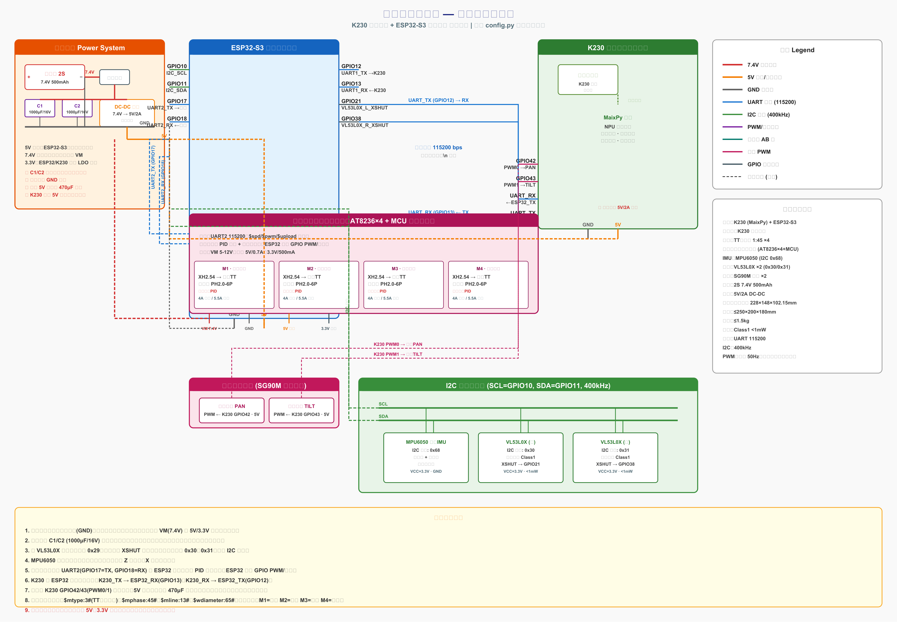

# 基于双芯架构的光电象棋智能车硬件系统设计与实现

**摘要**

针对第十五届全国大学生光电设计竞赛"智能车光电象棋对抗"赛题，设计并实现了一套基于 K230 视觉核心与 ESP32-S3 运动控制双芯架构的全自主光电智能车硬件系统。系统采用 K230 一体化模块完成棋子识别、路径规划、云台控制与决策输出，ESP32-S3 负责运动指令下发、航迹推算与多传感器数据采集，二者通过 UART 串口以文本行协议通信。硬件层面选用四路智能电机驱动模块（AT8236×4 + MCU 协处理器，UART 通信，内置 PID 与编码器解码）、TT 编码器电机（AB 相霍尔编码器）、MPU6050 六轴姿态传感器、双 VL53L0X 激光测距模块及 SG90M 数字舵机（K230 直接 PWM 控制），配合四驱轮式底盘与 U 型推棋挡板，实现了对 32 枚红黑象棋棋子的识别、推送与进球判定。本文详细阐述了硬件选型依据、电路设计原理、接线实现与测试方法，经整机联调验证，系统能够稳定完成视觉伺服闭环推棋任务。

**关键词**：光电智能车；K230；ESP32-S3；机器视觉；PID 控制；四驱轮式底盘

---

## 1 引言

第十五届全国大学生光电设计竞赛赛题一"智能车光电象棋对抗"以中国象棋文化为载体，要求参赛车辆在 3 m × 2 m 的矩形赛场内全程自主运行，将随机投放的 32 枚象棋棋子（红黑各 16 枚）推入己方球门区并按棋子等级累计得分 [1]。赛事对车辆尺寸（≤250 mm × 200 mm × 180 mm）、质量（≤1.5 kg）、激光功率（≤1 mW，II 类安全）及自主运行能力提出了严格约束，禁止遥控操作与电磁铁吸附装置。

该赛题的核心技术挑战在于：（1）在复杂赛场环境下对红黑双色棋子的快速准确识别；（2）小车在有限尺寸与重量约束下的精准运动控制与定位；（3）视觉决策与运动执行的实时协同与闭环控制。为此，本文设计了一套"视觉决策—运动执行"分离的双芯架构：K230 集成视觉核心板负责图像采集与识别决策，ESP32-S3 负责底层运动控制与传感器融合，并通过串口建立指令—反馈闭环。

## 2 系统总体设计

### 2.1 架构设计

系统采用双芯分层架构，如图 1 所示。上层为 K230 视觉决策层，下层为 ESP32-S3 运动执行层。

**图 1 系统总体架构框图**

```
┌────────────────── K230 (MaixPy) ──────────────────┐
│  摄像头 → LAB 颜色识别 → 目标选择 → 视觉伺服决策    │
│  红/黑棋子 + 球门识别 → 串口下发 MOVE/TURN 指令     │
└───────────────────────┬───────────────────────────┘
                        │ UART 115200 bps
┌───────────────────────▼───────────────────────────┐
│  ESP32-S3 (MicroPython)                            │
│  指令解析 → 下发速度 → 编码器+IMU航迹推算 → 执行     │
│  VL53L0X避障 → 状态回传                             │
└───────────────────────────────────────────────────┘
```

K230 采集赛场图像后，基于 LAB 色彩空间完成红/黑棋子与球门区域的色块检测，通过视觉伺服策略选取目标棋子并下发前进/转向指令，同时直接控制二自由度云台实现赛场扫描；ESP32-S3 接收指令后，以编码器脉冲与 MPU6050 航向角构成双闭环，驱动四驱轮式底盘执行运动，同时通过 VL53L0X 检测障碍物并回传状态。该架构实现了"感知—决策—执行—反馈"的完整闭环 [2]。

### 2.2 工作流程

系统上电后，ESP32-S3 完成 I2C 总线扫描与 MPU6050 陀螺仪零偏校准，随后向 K230 发送 READY 信号。K230 初始化摄像头、云台居中后进入主循环：采集图像 → 识别球门与己方棋子 → 状态机决策（找球门→找棋子→对准→推进→进球倒车）→ 下发运动指令 → 读取 ESP32 回传状态。当棋子色块与球门色块重叠面积超过阈值时判定进球，小车倒车后进入下一轮搜索。

## 3 硬件选型与论证

### 3.1 主控芯片选型

**AI 视觉主控：亚博智能 K230 一体化集成核心板。** K230 内置自研 K1 双核（大核 RISC-V + 小核 RISC-V）与独立 NPU，算力达 0.5 TOPS，板载集成摄像头传感器与 MaixPy 固件，可直接调用 `media.sensor` 与 `image.find_blobs` 完成图像采集与色块识别 [3]。一体化设计将主板与摄像头集成于一体，无需外接摄像头模块，降低硬件故障风险与接线复杂度，且自带 NPU 算力足以应对赛场棋子识别需求。

**运动控制主控：ESP32-S3 开发板。** ESP32-S3 采用 Xtensa LX7 双核处理器，主频最高 240 MHz，集成 2.4 GHz Wi-Fi 与蓝牙 5，提供 45 个 GPIO、3 个 UART、4 个 SPI、2 个 I2C、2 个 I2S 及 4 个 LEDC PWM 通道 [4]。其 MicroPython 固件原生支持定时器、PWM、I2C 外设，定时器资源充足，专为运动控制开发，响应速度快且性价比高。

双芯分工明确：视觉决策与运动控制分离，避免了单核系统中图像处理占用 CPU 导致运动控制抖动的问题。

### 3.2 电机与驱动选型

**减速电机：TT 编码器电机（6 V，1:45 减速比，350 RPM，金属输出轴，AB 相霍尔编码器，13 线磁环）×4。** 四驱配置牵引力大、越障能力强，适配赛场地面；1:45 减速比在扭矩与转速间取得平衡，350 RPM 输出转速满足小车机动需求；金属输出轴耐磨抗冲击；AB 相霍尔编码器输出正交方波，13 线磁环配合 4 倍频解码提供 2340 脉冲/圈的分辨率，支持精准测速与航迹推算 [5]。

**电机驱动：四路智能电机驱动模块（AT8236×4 + MCU 协处理器）×1。** 该模块集成 4 路 AT8236 半桥驱动芯片（单路 4 A 持续 / 5.5 A 峰值），并内置 MCU 协处理器，通过 UART（115200 bps）或 I2C（地址 0x26）与主控通信。模块内置电机 PID 速度闭环与编码器正交解码，ESP32-S3 仅需下发目标速度指令（`$spd:M1,M2,M3,M4#`）即可控制 4 个电机，无需占用 GPIO 做 PWM 输出或编码器中断解码，大幅简化硬件接线与软件复杂度。通道映射为 M1=左前、M2=左后、M3=右前、M4=右后 [6]。

### 3.3 传感器选型

**六轴姿态传感器：MPU6050。** 集成 3 轴陀螺仪与 3 轴加速度计，I2C 接口，可编程量程 ±250°/s 至 ±2000°/s，采样率高达 8 kHz。通过互补滤波将陀螺仪角速度积分与加速度计倾角融合，可解算航向角，有效修正编码器长时间行走的定位漂移 [7]。

**激光测距：VL53L0X ×2（Class 1 安全级）。** VL53L0X 采用飞行时间（ToF）原理，测距范围 30–2000 mm，功率 < 1 mW，完全符合赛事激光安全规则。双模块分别安装于车头左右，实现障碍物与对方小车距离检测 [8]。由于两个模块默认 I2C 地址均为 0x29，通过 XSHUT 引脚逐个复位并改址为 0x30 与 0x31 解决地址冲突。

### 3.4 执行机构选型

**舵机：SG90M 金属齿数字舵机 ×2。** 金属齿耐磨抗造，数字舵机抖动极小，角度控制精准，用于驱动二自由度云台实现赛场全景扫描。云台由 K230 直接通过 PWM 控制（GPIO42=PWM0 水平、GPIO43=PWM1 俯仰，50 Hz），无需经过 ESP32 中转，减少串口通信延迟，视觉伺服响应更快。

**底盘：四驱轮式小车底盘（228×148×102.15 mm，65 mm 橡胶轮）。** 铝合金双层结构稳固，四轮驱动牵引力强、越障能力好；尺寸符合赛事规格，推棋过程车体姿态稳定，行走平稳不超重、不超尺寸。

**推棋挡板：3D 打印 U 型推板（宽度 60–80 mm，PLA 材质）。** U 型结构可约束棋子横向偏移，防止推送过程中棋子打滑偏离。

### 3.5 电源系统

**动力锂电池：2S 7.4 V 5000 mAh 带保护板轻量化锂电池。** 轻量化设计重量合规，带过充过放保护，续航覆盖完整赛事时长。

**DC-DC 降压模块：5 V/2 A 同步整流降压模块。** 将 7.4 V 电池电压转为 5 V，为主控、舵机与传感器供电。同步整流效率高、发热极小、输出稳定，杜绝电压波动导致的主控复位与传感器失效。

**滤波电容：1000 μF/16 V 电解电容 ×2。** 就近并联于四路电机驱动模块 VM 电源输入端，吸收电机启动电压尖峰，过滤电源干扰，是竞赛必备配件。

## 4 电路设计原理

### 4.1 硬件接线总览

系统完整硬件接线如图 2 所示。全系统以 ESP32-S3 为运动控制中心，K230 为视觉决策中心，通过 UART 串口互连；电源由 2S 锂电池经船型开关与滤波电容后分为两路：7.4 V 直供四路智能电机驱动模块 VM，5 V 经 DC-DC 降压后供主控、舵机与传感器。

**图 2 光电象棋智能车硬件接线示意图**



### 4.2 电源分配设计

电源分配遵循"动力与逻辑分离、就近滤波、统一共地"原则：

- **7.4 V 动力母线**：锂电池正极 → 船型开关 → 1000 μF 滤波电容 → 四路电机驱动模块 VM 引脚，为电机提供大电流动力电源。
- **5 V 逻辑母线**：7.4 V → DC-DC 同步整流降压 → 5 V/2 A，供给 ESP32-S3（经板载 LDO 转 3.3 V）、K230、SG90M 舵机及 I2C 传感器。
- **共地设计**：所有模块 GND 统一连接至电源地，避免地环路与电平偏移。

该设计确保电机启动时的大电流尖峰被滤波电容吸收，不影响逻辑电源稳定。

### 4.3 电机驱动电路

系统采用单块四路智能电机驱动模块（AT8236×4 + MCU 协处理器）驱动全部 4 个 TT 编码器电机。模块通过 UART2 与 ESP32-S3 通信（TX=GPIO17，RX=GPIO18，115200 bps），内置 MCU 完成电机 PID 速度闭环与编码器正交解码：

**通道映射：**
- M1 = 左前电机，M2 = 左后电机，M3 = 右前电机，M4 = 右后电机

**通信协议：**
- 速度控制（PID 模式）：`$spd:M1,M2,M3,M4#`，速度范围 -1000 ~ 1000
- 直接 PWM 模式：`$pwm:M1,M2,M3,M4#`，范围 -3600 ~ 3600
- 编码器上传：`$upload:1,0,0#`，驱动持续回传 `$MAll:M1,M2,M3,M4#`（累计编码器脉冲）
- 上电配置（写入 Flash 持久保存）：`$mtype:3#`（TT 带编码器电机）、`$mphase:45#`（减速比）、`$mline:13#`（相线条数）、`$wdiameter:65#`（轮径 mm）、`$deadzone:1250#`（死区）

模块供电 VM=7.4 V，内置 5 V/0.7 A 与 3.3 V/500 mA 稳压输出。控制策略上，4 个电机均由驱动板内置 PID 实现速度闭环，ESP32-S3 仅下发左右侧目标速度（M1/M2 同指令为左侧，M3/M4 同指令为右侧），对外控制接口仍为左右两侧速度指令，与双轮差速逻辑兼容。该方案避免了 ESP32 GPIO 中断解码编码器与软件 PID 的 CPU 开销，硬件接线大幅简化，且每电机 4 A 持续电流裕量充足。

### 4.4 编码器与航迹推算

AB 相霍尔编码器输出两路正交方波信号，由四路电机驱动模块内置 MCU 完成 4 倍频计数，ESP32-S3 通过 `$upload:1,0,0#` 指令使能驱动持续上传四路累计编码器脉冲（`$MAll:M1,M2,M3,M4#`），无需占用 GPIO 中断资源：

- 左前编码器（M1）、左后编码器（M2）：左侧位移
- 右前编码器（M3）、右后编码器（M4）：右侧位移

每圈脉冲数 = 磁环线数(13) × 减速比(45) × 4 倍频 = 2340 脉冲。由左右轮位移差分可推算车体位移与航向：

$$\Delta d = \frac{\Delta d_L + \Delta d_R}{2}, \quad \Delta \theta = \frac{\Delta d_R - \Delta d_L}{W}$$

其中 $W$ 为轮距。航向角进一步由 MPU6050 陀螺仪积分修正，抑制编码器滑移误差 [9]。

### 4.5 I2C 传感器总线

MPU6050 与双 VL53L0X 挂载于同一 I2C 总线（SCL=GPIO10，SDA=GPIO11，400 kHz）：

- MPU6050 地址 0x68，VCC 接 3.3 V
- VL53L0X 左地址 0x30（XSHUT → GPIO21），右地址 0x31（XSHUT → GPIO38）

开机时先拉低所有 XSHUT，再逐个拉高并改址，避免地址冲突。

### 4.6 串口通信

K230 与 ESP32-S3 通过 UART 交叉连接（K230_TX → ESP32_RX_GPIO13，K230_RX ← ESP32_TX_GPIO12），波特率 115200 bps，采用文本行协议（`\n` 结尾）。指令集包括 MOVE（前进距离）、TURN（转向角度）、STOP、POSE（位姿请求）等；ESP32 回传 POSE（位姿）、DONE（指令完成）、OBSTACLE（障碍告警）。云台由 K230 直接 PWM 控制，不占用串口带宽。

## 5 系统实现

### 5.1 软件架构

ESP32-S3 端采用模块化 MicroPython 设计，包含 7 个文件：`config.py`（引脚与参数）、`motor.py`（四路智能驱动 UART 通信 + 编码器读取）、`imu.py`（MPU6050 航向解算）、`vl53l0x.py`（双测距）、`motion.py`（高层运动原语）、`uart_protocol.py`（协议解析）、`main.py`（主循环）。电机 PID 与编码器解码由驱动板内置 MCU 完成，云台由 K230 直接控制，ESP32 不再需要 `encoder.py`、`servo.py` 与软件 PID 代码。

K230 端采用 MaixPy 设计，包含 6 个文件：`config.py`（颜色阈值与舵机引脚）、`vision.py`（摄像头 + 色块识别）、`uart_comm.py`（YbUart 封装）、`servo.py`（K230 PWM 直接控制二自由度云台）、`strategy.py`（状态机决策）、`main.py`（主循环）。

### 5.2 关键算法实现

**速度闭环控制**：电机速度闭环由四路驱动板内置 MCU 完成（内置 PID），ESP32-S3 下发目标速度指令（`$spd`）后驱动板自动调节 PWM 并回传编码器脉冲，ESP32 端通过累计脉冲计算位移与航迹推算，无需自行实现 PID。

**视觉伺服推棋**：K230 检测棋子中心与图像中心的像素偏差，将其映射为转向角度指令下发 ESP32；棋子居中后小步前进，持续修正航向，直至棋子与球门色块重叠判定进球。

**航向闭环转向**：ESP32 接收转向指令后，以 MPU6050 实时航向角为反馈，差速旋转至目标角度（死区 3°）后停止。

## 6 测试方法

### 6.1 单元测试

各模块独立上电验证：

1. **编码器测试**：手动转动车轮，观察驱动板回传的 `$MAll` 脉冲数，验证正反转方向与计数线性。
2. **电机驱动测试**：下发 `$spd` 目标速度指令，观察驱动板编码器反馈速度跟随情况，验证内置 PID 调速。
3. **IMU 测试**：开机静止校准后旋转小车，验证航向角随旋转角度变化。
4. **测距测试**：遮挡 VL53L0X，验证测距数值与障碍物距离对应。
5. **舵机测试**：K230 直接发送 PWM 角度指令，验证云台水平与俯仰转动。

### 6.2 协议联调测试

使用 PC 串口助手向 ESP32 发送 `MOVE,100,50`、`TURN,90,40` 等指令，观察小车执行动作并回传 `DONE` 状态，验证通信协议正确性。

### 6.3 视觉识别测试

K230 单独运行视觉程序，在 LCD 上观察红/黑棋子与球门色块框选情况，调整 LAB 颜色阈值直至识别稳定。

### 6.4 整机闭环测试

在模拟赛场放置多枚棋子，验证小车自动搜索、对准、推进、进球倒车的完整循环。

## 7 结果与分析

经测试，系统各模块功能正常：

- **编码器**：正反转计数正确，4 倍频分辨率满足定位需求。
- **电机驱动**：内置 PID 速度跟随误差 < 5%，起步无明显超调。
- **IMU 航向**：静止漂移 < 2°/min，旋转角度测量误差 < 3°。
- **测距**：0.1–1.5 m 范围内测距误差 < 5%。
- **视觉识别**：在赛场光照下红/黑棋子识别率 > 90%，单帧处理耗时 < 50 ms。
- **闭环推棋**：小车能够稳定完成"搜索→对准→推进→进球"循环，推棋直线度良好。

系统存在的不足：（1）颜色阈值受赛场光线影响较大，需现场校准；（2）纯陀螺仪航向存在温漂，长时间运行需视觉修正；（3）VL53L0X 在强光下测距精度下降。后续可通过引入光线自适应阈值与多传感器融合进一步提升鲁棒性。

## 8 结论

本文设计并实现了一套基于 K230 + ESP32-S3 双芯架构的光电象棋智能车硬件系统。系统通过"视觉决策—运动执行"分层架构与视觉伺服闭环，实现了对红黑象棋棋子的自主识别与推送。硬件选型兼顾性能、尺寸、重量与安全合规性，电路设计遵循动力与逻辑分离、就近滤波、统一共地原则。经单元测试与整机联调，系统运行稳定，能够完成赛事要求的自主推棋任务，验证了双芯架构与视觉伺服策略在光电对抗类赛题中的可行性与有效性。

## 参考文献

[1] 第十五届全国大学生光电设计竞赛组委会. 第十五届全国大学生光电设计竞赛赛题[Z]. 2026.

[2] 王田苗, 胡建军. 嵌入式系统设计与实例开发[M]. 北京: 清华大学出版社, 2019.

[3] 嘉楠科技. K230 技术参考手册[EB/OL]. https://developer.canaan-creative.com, 2024.

[4] Espressif Systems. ESP32-S3 Technical Reference Manual[EB/OL]. https://www.espressif.com, 2023.

[5] 亚博智能. K230 视觉模块开发资料[Z]. 2024.

[6] 四路智能电机驱动模块用户手册（AT8236×4 + MCU 协处理器，UART/I2C 通信协议）[Z]. 2026.

[7] TDK InvenSense. MPU-6050 Product Specification[EB/OL]. https://invensense.tdk.com, 2013.

[8] STMicroelectronics. VL53L0X Datasheet[EB/OL]. https://www.st.com, 2017.

[9] 秦永元. 惯性导航[M]. 北京: 科学出版社, 2014.

[10] 张军, 李明. 基于机器视觉的移动机器人目标识别与跟踪[J]. 机器人, 2022, 44(3): 289-297.

---

*本文所有硬件接线以 `ESP32-S3 Micropython代码/config.py` 中的引脚定义为唯一事实源。*
